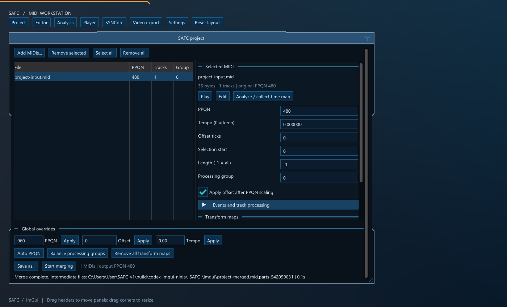
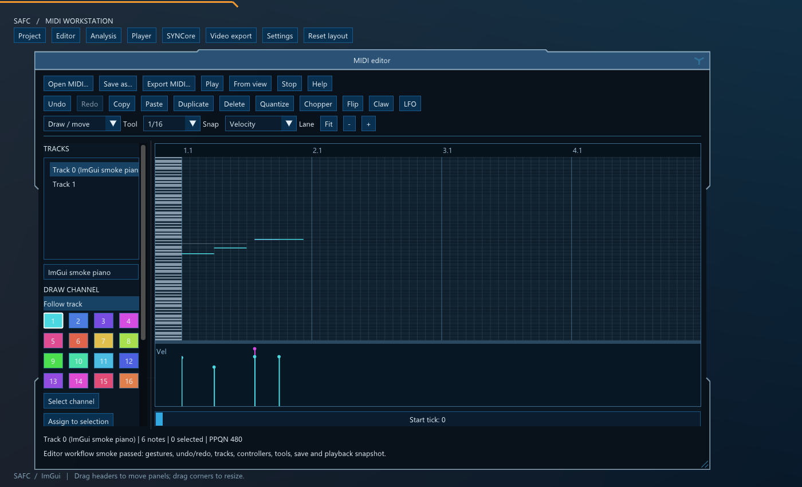
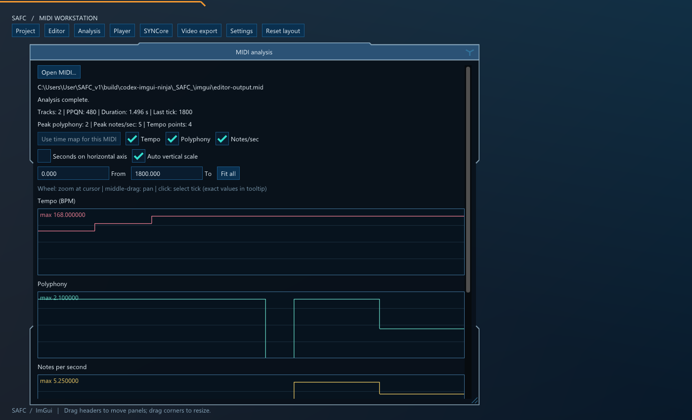

# SAFC with Dear ImGui

The default CMake application now uses Dear ImGui for the complete SAFC workspace:
project processing and merging, playback, the MIDI editor, analysis, transform
maps, SYNCore settings, and MP4 rendering. `SAFC.exe` is the primary executable;
`SAFCImGui.exe` runs the identical frontend at the former preview target path.



Folded headers, inset panels, partial outlines, and the three-spoke close symbol
remain part of the window design. Ordinary controls are Dear ImGui buttons,
inputs, sliders, tables, lists, checkboxes, and popups. Windows file pickers remain
native OS dialogs. Specialized editors and plots use ImDrawList canvases; the
existing falling-note player renderer is presented through an OpenGL framebuffer
texture. No SAFGUIF widget tree or GLUT event loop is used by the new application.

## Workflows

Use the workspace navigation to open or hide panels. Hiding a panel leaves its
document and running job alive. Drag folded captions to move panels and corners
to resize them; **Reset layout** restores the initial arrangement.

- **Project:** add MIDI files with the picker or drag and drop, select several
  files with Ctrl, and edit per-file or global PPQN, tempo, offset, selection,
  processing groups, event filters, channel splitting, track collapse, running
  status, and related processor settings. Selected files can receive copied
  processing settings. The project retains stable file identities when other
  entries are removed. Merge progress and cancellation are part of the same
  workspace.
- **Transform maps:** edit cut/transpose, velocity, and 14-bit pitch-bend maps
  using native numeric controls and editable canvases. Copy/paste and map reset
  operate on the corresponding map type. Processing jobs receive their own map
  copies so later UI edits cannot change an in-flight merge.
  Cut/transpose shows the shifted output piano above the fixed input piano;
  vertically aligned keys show each source-to-output mapping. Drag the lower
  piano to set the input cut range.
- **Player:** use normal MIDI files or compressed/nested archive sources; choose
  a member when an archive contains several candidates. Select a MIDI device or
  embedded SYNCore, play, pause, stop, seek, adjust the logarithmic visible-time
  range, and choose simulated lag or the existing overlap modes.
- **MIDI editor:** load/save/export MIDI, select tracks and draw channels, rename
  tracks, draw/erase/move/resize/stretch notes, edit velocity and controllers,
  copy/paste/duplicate, quantize, and undo/redo. Chopper, Flip, Claw, and LFO retain
  Preview/Accept/Cancel transactions. Editor playback streams a snapshot of
  unsaved edits into the shared player; its independent reader factory also
  supports MP4 export without an intermediate MIDI save.
- **Analysis:** inspect tempo, polyphony, and notes per second; zoom and pan in
  ticks or seconds, query exact values, and convert between tick and time.
  Collected timing can be applied to the corresponding project MIDI. Export
  combined CSV/ATRAW data, tempo CSV, or notes-per-second CSV. Dense graph display
  uses bounded envelopes while exact queries and exports retain source data.
- **Video render:** configure dimensions, frame rate, visible time, tail,
  H.264 video bitrate, AAC bitrate/rate, and SYNCore settings. Audio and video
  render on owned workers with progress, preview frames, and cancellation.
  Regular files, selected archive members, and editor snapshots use independent
  audio/video readers.
- **Settings:** apply processing defaults, choose appearance and interface scale,
  configure SYNCore, and explicitly save preferences. **Project / releases** opens
  the releases page; it replaces the former in-app executable updater.



### Editor input

The default tool draws on empty space and moves existing notes. Drag a note's
right edge to resize; hold Ctrl on that edge to stretch the selection. Shift-drag
adds a selection rectangle, and Shift+Alt removes notes from the selection.
Right-click erases an active-track note or switches to a visible ghost track.
The separate Select and Erase tools are also available.

Middle-drag pans time. The wheel zooms around the pointer; Shift+wheel scrolls
time. The wheel over the keyboard zooms pitch, and right-dragging the keyboard
scrolls pitch. Alt bypasses snap for supported note gestures. The controller
lane paints with left-drag and creates a ramp with right-drag. Its targets are
velocity, pitch bend, pan, channel volume, and tempo; LFO targets the first four.
The tempo lane has an adjustable logarithmic range covering MIDI's full tempo
limits, plus exact tick/BPM entry for inserting tempo points.

| Shortcut | Action |
| --- | --- |
| Ctrl+Z / Ctrl+Y or Ctrl+Shift+Z | Undo / redo |
| Ctrl+C / X / V / B | Copy / cut / paste / duplicate |
| Ctrl+A / Ctrl+D | Select active track / deselect |
| Shift+C / Alt+C | Select draw channel / assign it to selection |
| Arrow keys | Move by grid step or semitone |
| Ctrl+Up / Ctrl+Down | Transpose by an octave |
| Delete / Q | Delete selection / quantize |
| Space | Play from the visible start, or stop current playback |
| Ctrl+O / Ctrl+S | Open / save as |
| Alt+U / Y / W / O | Chopper / Flip / Claw / LFO |
| Alt+V / Esc | Toggle ghost tracks / cancel a gesture |

A completed tool preview becomes one undo entry only after Accept. Cancel restores
its original notes, selection, and modified state. Note and controller gestures
commit on release. Save writes to a temporary sibling and replaces the selected
output only after successful export; a failed replacement keeps the old output
and leaves the document marked modified. Export MIDI leaves the modified flag
unchanged. Choose an output different from the currently memory-mapped source.



## Build and run

The frontend currently requires Windows, a C++23-capable MSVC toolchain, and an
OpenGL 3.3 compatibility context. Initialize the submodules and use the static CRT
vcpkg triplet. The additional frontend dependencies are `glfw3` and `imgui` with
`glfw-binding` and `opengl3-binding`; the complete dependency list remains in the
repository's `dependencies.txt`. The implementation uses the installed standard
Dear ImGui 1.91.9 and GLFW 3.4 APIs, without a docking fork.

From an x64 Visual Studio developer shell:

```powershell
git submodule update --init --recursive
cmake -S . -B build/imgui -G Ninja `
  -DCMAKE_BUILD_TYPE=Release `
  -DCMAKE_TOOLCHAIN_FILE=C:/vcpkg/scripts/buildsystems/vcpkg.cmake `
  -DVCPKG_TARGET_TRIPLET=x64-windows-static `
  -DSAFC_BUILD_IMGUI=ON -DBUILD_TESTING=ON
cmake --build build/imgui --target SAFC SAFCImGui
& ./build/imgui/SAFC.exe
```

`SAFC_BUILD_IMGUI` defaults to `ON`. `SAFC_BUILD_IMGUI_PREVIEW=ON` remains an
accepted enabling alias for old build scripts. The `_SAFC_` CMake entry point
supports the same options. `SAFC_ENABLE_SYNCORE=OFF` builds with external MIDI
output and disables functionality that requires embedded synthesis.

The former interface is an optional compatibility target:

```powershell
cmake -S . -B build/legacy -G Ninja `
  -DCMAKE_BUILD_TYPE=Release `
  -DCMAKE_TOOLCHAIN_FILE=C:/vcpkg/scripts/buildsystems/vcpkg.cmake `
  -DVCPKG_TARGET_TRIPLET=x64-windows-static `
  -DSAFC_BUILD_IMGUI=OFF -DSAFC_BUILD_LEGACY_GUI=ON
cmake --build build/legacy --target SAFCLegacy
```

The checked-in Visual Studio solution remains the classic SAFGUIF application;
use CMake for the ImGui frontend. Both frontend executables share the same entry
object and application library rather than maintaining separate implementations.

### JSON command line

Passing a JSON configuration runs the processing workflow without creating the
GUI. The same applies through either executable name:

```powershell
& ./build/imgui/SAFC.exe ./merge.json
& ./build/imgui/SAFC.exe --help
```

```json
{
  "global_ppq_override": 960,
  "save_to": "C:\\MIDIs\\merged.mid",
  "files": [
    {
      "filename": "C:\\MIDIs\\input.mid",
      "offset": 0,
      "selection_start": 0,
      "selection_length": -1,
      "piano_only": true
    }
  ]
}
```

Relative paths resolve from the current working directory. `--help` describes
all supported settings and ranges. Inputs and overrides are validated before a
merge starts, signed 64-bit per-file tick values retain their integer precision,
and output cannot replace an input MIDI. Normal CLI runs read saved defaults and
do not write preferences. A MIDI filename argument opens the interactive
workspace; the normal picker and drop path add MIDIs to the project.

## State, workers, and persistence

The frontend composition root in `main.cpp` owns sessions and passes focused
references into panels. UI state is typed data, rather than being recovered from
a global window-handler map. `platform_dialogs.h` carries callbacks bound to the
native owner window, keeping platform handles out of panel models.

| Owner | State and responsibilities |
| --- | --- |
| `project_session` | File identities, processing options, defaults, immutable merge snapshots, load/merge jobs |
| `playback_session` | MIDI player, selected output/source, synthesis settings, playback/cancellation workers |
| `editor_panel::impl` | MIDI document and history, canvas gestures, tool transactions, serialized load/save/preview jobs |
| `analysis_panel::impl` | Analysis and export jobs, published result, plots and exact queries |
| `video_export_panel::impl` | Offline renderer, captured settings, progress, cancellation, UI-context preview texture |
| `mapping_panel` | Typed map editors, gestures, clipboard values |
| `preferences_store` | Import and explicit persistence of application defaults |

Workers receive owned requests, publish data or synchronized snapshots, and never
call ImGui or look up GUI objects. Completion is consumed on the UI thread,
including while an editor panel is hidden. Shutdown cancels and joins workers,
stops playback and the synth in their required order, and releases preview/GL
resources before destroying the graphics context.

The shared processor/player/editor domain is retained. `app/project_model.*`
contains project data and processing conversion; `SAFC_InnerModules/core_support.h`
provides the core helpers and diagnostics that previously arrived through the
SAFGUIF umbrella. The new `safc_imgui_core` target does not link the legacy widget
implementation or GLUT. The optional legacy target still uses its existing app
and SAFGUIF modules.

Common application and SYNCore preferences are imported from
`HKCU\Software\SAFC`. They are written only through explicit **Apply and save**
or **Save preferences** actions. Window positions and sizes use Dear ImGui's
separate `%LOCALAPPDATA%\SAFC\imgui.ini` file. Smoke and regression modes do not
change registry preferences or the user's saved workspace layout.

Merges use an owned settings snapshot and a unique sibling work directory. Only
a completed output replaces the chosen destination; cancellation, input errors,
and write failures preserve the previous destination. When **Remove intermediate
files** is disabled, the processed files are retained in a reported
`<output>.parts-<id>` directory. Their names include the input index, original
filename, and editable intermediate suffix. Other runs clean up their work files.
The saved preferences also import the existing player render settings.

## Validation and current boundaries

Build the default test targets, then run:

```powershell
cmake --build build/imgui
ctest --test-dir build/imgui -R '^safc-imgui-' --output-on-failure
```

| CTest name | Coverage |
| --- | --- |
| `safc-imgui-smoke` | Hidden OpenGL workspace, transport/input and screenshot capture |
| `safc-imgui-workflows` | Project/editor/analysis workflow integration and workspace capture |
| `safc-imgui-editor` | Owned load, note/controller gestures, tools, save/reload, destination preservation, real ImGui input, stable track IDs, expanded tool/combo ID checks and silent playback |
| `safc-imgui-analysis` | Tempo integration, graph peaks, exact CSV/ATRAW exports, native map rendering, graph/checkbox ID isolation and clicks, cancellation and invalid input |
| `safc-imgui-widget-ids` | Conflict-detector negative control, duplicate names, literal `##`/`###` labels, multiline rows, native selection and per-file property IDs |
| `safc-imgui-mapping-ids` | All map windows, extended keyboard banks, numeric step buttons, expanded points, segment mode and disabled branches |
| `safc-imgui-mapping-layout` | Fixed canvas bounds through native segment start, completion, cancellation and restart for velocity and pitch maps |
| `safc-imgui-key-map` | Shifted output piano, octave alignment, fixed source keys, cut highlighting, extreme transpositions and native bank-aware cut dragging |
| `safc-imgui-playback` | External sources, nested/archive member selection, cancellation, replay and actual short sine-based MP4 rendering |
| `safc-imgui-cli` | JSON validation, integer precision, input identity and processing output |

ID regressions use the same counter as Dear ImGui's runtime conflict warning;
rendering geometry alone does not detect these conflicts. Keep diagnostic
highlighting enabled. Scope repeated controls with stable model IDs, and use
`widgets.h` for selectable user text so names are not parsed as ImGui labels.
Canvases use explicit hidden IDs independent of their visible captions.

The hidden capture modes are `--smoke <capture.bmp>` and
`--workflow-smoke <capture.bmp>`. Fixtures and generated outputs stay beside the
test captures or in the test output directories. Transport tests explicitly use
a silent output; MP4 regressions synthesize their own short sine audio offline.
These checks do not establish audible quality on physical MIDI devices, every
SF2/SFZ bank, or sustained performance on the user's dense MIDI collections.

The editor retains the existing domain's format-1 save reconstruction and
255-processed-track limit. Captured non-note events are retained, but original
binary event layout/running-status formatting is not preserved. SMPTE division
is not represented as native SMPTE editor timing. Loading, tool transforms,
playback snapshot creation, and saving can still require substantial memory for
large scores; the UI's viewport queries avoid copying the entire score every
frame, but are not a guarantee for arbitrary black-MIDI density. MIDI source
replacement during editor Save is deliberately rejected while that source is
memory mapped. MP4 export remains dependent on Windows Media Foundation and an
available OpenGL compatibility renderer.
