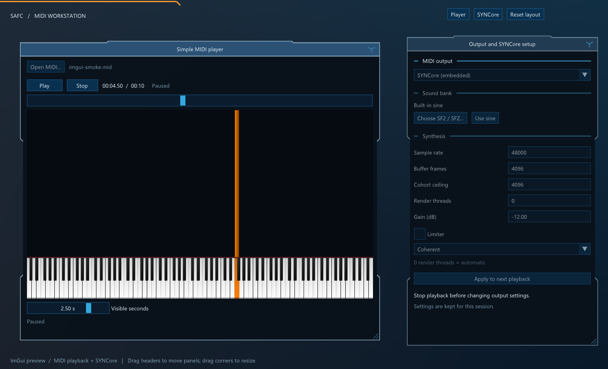

# SAFC ImGui migration

This directory is the first executable slice of an ImGui frontend: MIDI playback,
output selection, SYNCore settings, and the existing piano visualization. It is
an optional `SAFCImGui` target. The existing SAFC executable remains the complete
application while the other workflows migrate.



The intended destination replaces SAFGUIF's retained widget tree and event
dispatch with Dear ImGui windows and standard controls. Here, **native widgets**
means Dear ImGui's own buttons, inputs, sliders, tables, and popups. Windows file
dialogs remain native OS dialogs.

## What the first slice implements

- Folded headers, inset panel waists, deliberately interrupted outlines, dark
  panels, and the three-spoke close symbol, drawn with public ImGui APIs.
- Movable and resizable panels with native ImGui content clipping, scrolling,
  focus, text editing, keyboard navigation, checkboxes, combos, and sliders.
- Open or drop a regular `.mid`/`.midi`; open prepares a paused session. Play
  starts it, Pause holds it, Stop retires it, and Play after stopping reopens and
  starts it in one click.
- A timeline slider that submits a seek when editing finishes.
- Existing MIDI outputs and embedded SYNCore, with SF2/SFZ or built-in sine,
  sample rate, buffer, cohort limit, thread count, gain, limiter, and phase mode.
  **Apply to next playback** commits the draft to the session.
- An owned playback service and worker. Workers publish data and never touch
  ImGui objects. Output preparation and MIDI parsing run off the UI thread.
- The existing piano renderer draws into a framebuffer texture. ImGui owns that
  texture item's clipping and overlap with other windows.

Settings and layout are session-only in this preview. The registry settings in
the complete application are not imported or overwritten. Archive playback,
merging, file processing, the editor, analysis tools, and MP4 export still use
the complete application. Closing a panel hides it; the navigation buttons
reopen it. Closing the application shuts down playback and its audio output.

## Build and run

Use the existing Windows C++23/static-CRT toolchain and vcpkg dependencies. The
additional packages are `glfw3` and `imgui` with `glfw-binding` and
`opengl3-binding`. This slice was developed against the locally installed
Dear ImGui **1.91.9** and GLFW **3.4**; it does not download dependencies at build
time or require an ImGui fork.

Run from an x64 Visual Studio developer shell:

```powershell
cmake -S . -B build/imgui -G Ninja `
  -DCMAKE_BUILD_TYPE=Release `
  -DCMAKE_TOOLCHAIN_FILE=C:/vcpkg/scripts/buildsystems/vcpkg.cmake `
  -DVCPKG_TARGET_TRIPLET=x64-windows-static `
  -DSAFC_BUILD_IMGUI_PREVIEW=ON -DBUILD_TESTING=ON
cmake --build build/imgui --target SAFCImGui
& ./build/imgui/_SAFC_/imgui/SAFCImGui.exe
```

The `_SAFC_` CMake entry point supports the same option. The maintained legacy
Visual Studio project does not acquire preview sources or ImGui dependencies.
Configure `SAFC_ENABLE_SYNCORE=OFF` for a MIDI-device-only preview.

An optional filename argument opens a regular MIDI. The test mode is hidden and
silent, produces a screenshot, and exits on a bounded timeout:

```powershell
ctest --test-dir build/imgui -R safc-imgui-smoke --output-on-failure
```

`--smoke <capture.bmp>` also writes `imgui-smoke.mid` beside the capture. Its
transport checks use a silent output sink, not a physical audio device.

## Ownership and module boundaries

The recent `app/` translation-unit split is useful, but it has not yet separated
UI ownership from application data. `app/app_state.h` imports the GUI umbrella,
and `SAFGUIF/header_utils.h` still defines shared player/editor, window, font,
and preference globals. Many worker callbacks find a widget by string ID and
change it directly. Replacing widget constructors alone would retain that
coupling.

The destination should be explicit ownership with focused service references:

```text
Application
  ProjectSession       files, processing options, merge defaults
  PlaybackSession      player, selected source/output, playback worker
  EditorSession        document, edit history, live playback source
  JobServices          analysis / merge / export requests and results
  PreferencesStore     durable defaults and registry migration
  WorkspaceUi          open panels, selection, drafts, canvas gestures
  PlatformRuntime      HWND / GL context / input / dialogs / frame loop

Panel -> typed service command -> worker-owned request
Panel <- immutable result or synchronized status snapshot
```

The application is a composition root, not another globally accessible
mega-structure. Panel functions receive the particular session or view state
they need. CLI processing uses project/settings/job services without creating
ImGui, a platform window, or a registry-dependent UI singleton.

Rules for each migrated workflow:

1. UI state belongs to the UI thread. Widgets bind to typed values, never serve
   as the authoritative store for a setting or result.
2. Use stable `FileId`/`JobId`/document identities rather than vector indices or
   window-name strings. Completed work carries its identity/generation, so an
   old result cannot update a newly selected file.
3. Apply submits a validated value copy. Tool Preview/Cancel/Accept preserve
   their existing transaction semantics. A worker receives immutable processing
   settings, including copies of mutable key/volume/pitch maps.
4. Status is polled once per UI frame. Replace watcher threads that update
   labels, lists, and sliders with synchronized snapshots/results.
5. Every asynchronous job has one owner, cancellation, and a terminal join.
   Shutdown cancels jobs, stops the synth/player, joins workers, and only then
   releases UI and graphics resources. Hiding a panel is separate from job
   cancellation.

The first `playback_session` proves this shape without importing `app_state.h`.
It keeps request values on the UI thread, captures them before worker dispatch,
sets busy before launch, and rejects replacement until the old run retires.
Stop retires the output on an owned shutdown worker, so cancellation also reaches
synth preparation and does not depend on frame polling. It preserves
`simple_player::shutdown()` before joining a paused run. Shared playback-clock
reads/writes are synchronized; the clock lock does not span rendering, output
delivery, sleeps, or bulk buffer cleanup.
The core still transitively includes `SAFGUIF/header_utils.h`; extracting
portability helpers, graphics declarations, and diagnostic sinks is part of
the final dependency removal. This preview does not claim that SAFGUIF has
already been deleted.

## Preserve the visual identity

The reference's identity is window geometry and layering: the raised central
header fold, chamfered shoulders, inset vertical panels, interrupted side
outlines, translucent border passes, slate-blue header, dark body, and compact
three-spoke close mark. These come from
[`moveable_fui_window.h`](../SAFGUIF/moveable_fui_window.h), particularly its
`draw()` implementation. Spacing, fonts, control labels, and grouping can evolve.

[`folded_theme.cpp`](folded_theme.cpp) recreates those decorations. The helper
uses one native ImGui parent plus a content child. A small caption drag target
and close button sit above the content. It is a skin and window helper, not a
replacement widget framework. Call `end_folded_window()` even when begin returns
false. Inside begin, the current window is the **content child**; use the helper's
parent-geometry accessors if parent coordinates are needed.

ImGui windows retain rectangular input bounds. The small visual cutouts do not
pass clicks through to another window as SAFGUIF's polygon hit test can. This
does not change the visible silhouette, but it is an explicit interaction
difference. Exact polygon click-through would require a separately justified
input solution. Header collapse and persistent layout are also outside this
first slice.

Use stock controls for generic interaction. Keep dedicated canvases for the
piano roll, editable maps, and graphs. They should receive local coordinates
from a focused/hovered ImGui item and respect capture while a text field is
being edited. Reusing the piano OpenGL renderer avoids replacing dense MIDI
rendering with one ImGui widget per note.

## Backend decision

This slice uses the existing installed GLFW platform backend and OpenGL 3
renderer backend with an **OpenGL 3.3 compatibility context**. Compatibility is
required by SAFC's retained fixed-function piano drawing. The new controls use
the standard ImGui OpenGL renderer. No GLUT event loop or SAFGUIF window handler
runs in the preview; GLUT remains a transitive core-header/build dependency.

Official Dear ImGui documentation separates platform and renderer backends and
recommends reusing the supplied implementations. It explicitly discourages GLUT
for a new integration. The Win32 platform backend is also a reasonable final
Windows-only choice; the preview's panel/service code does not depend on GLFW.
See [upstream backend guidance](https://github.com/ocornut/imgui/blob/master/docs/BACKENDS.md).

Docking and multiple OS viewports are separate future choices. The current
floating panels preserve the familiar presentation without making either a
prerequisite. Docking can change folded headers into tabs; multiple viewports
also need GL-context and DPI validation. See
[upstream docking setup](https://github.com/ocornut/imgui/wiki/Getting-Started#additional-code-to-enable-docking)
and [multi-viewports](https://github.com/ocornut/imgui/wiki/Multi-Viewports).

## Remaining migration, in dependency order

The current source constructs 21 logical windows (including conditional SYNCore
and framework alerts/prompts), 20 with folded chrome. Source inventory:

| Workflow | Existing implementation | Migration |
| --- | --- | --- |
| Main file list, utilities, per-file and other settings | `app/ui.cpp`, `file_actions.cpp`, `file_properties.cpp` | Native table with stable selection IDs; typed drafts and project commands |
| App settings and SYNCore | `app/settings.cpp`, `syncore_settings.cpp` | Shared validated preferences model and durable store; then replace registry callbacks |
| Player and archive source | `app/player_controls.cpp`, `playback_source.cpp` | Extend PlaybackSession to compressed sources, progress/cancel, output restore, and source ownership |
| Merge/progress container | `app/merger.cpp`, `midi_processor_visualiser.h` | Job-owned requests/progress; remove detached threads retaining widget references |
| Analysis and graphs | `app/midi_analysis.cpp`, `graphing.h` | Analysis job snapshots, canvas selection, time maps and exports |
| Cut/transpose and volume/pitch maps | `cut_and_transpose_piano.h`, `volume_graph.h` | Native controls around domain canvases; retain editing and copy/paste semantics |
| MP4 export | `player_video_render_ui.cpp` | Export draft/command, existing exporter, progress snapshots and preview texture |
| MIDI editor and its lanes | `app/editor.cpp`, `midi_editor_viewer.h` | Separate document/session from viewport/gesture state; port rendering and input together |
| Chopper, Flip, Claw, LFO | `midi_editor_tools_ui.cpp` | Native controls preserving preview rollback and single accept commit |
| Alerts, prompts, support | `windows_handler.h`, `app/ui.cpp` | Typed notifications/modal state; native ImGui popups |

Suggested mergeable stages:

1. **Playback and visual identity** — this slice; validate the look, window/input
   behavior, core timing, and teardown on real hardware and representative MIDI.
2. **Project and preferences** — extract pure project/defaults models and durable
   preference storage, migrate the file list and form screens. Preserve CLI
   behavior and existing registry keys. This provides the real application shell.
3. **Jobs and domain tools** — migrate merge, analysis, maps, and alerts with
   owned jobs. Eliminate GUI polling workers and detached widget-reference work.
4. **Complete playback/export** — archives, editor playback handoff, MP4 render
   draft/progress/preview, device restoration and output preparation UX.
5. **Editor** — port its piano roll, track/channel selection, controller lanes,
   keyboard gestures, undo/redo and tool preview transactions. This is the largest
   interaction migration; validate it independently from ordinary forms.
6. **Retire SAFGUIF** — move the chosen frontend into the normal entry point,
   remove old UI construction/lookup/event code and obsolete globals, extract
   remaining core portability/diagnostic/GL dependencies, remove GLUT when no
   remaining core or renderer requires it, and align all maintained build files.

Completion means all supported workflows have parity, not merely that the old
include directory can be removed. Each stage should build and remain useful;
temporary adapters must have a named removal stage.

## Validation boundaries

Validated on 2026-09-07:

| Check | Result |
| --- | --- |
| Root CMake entry, x64 Release, ImGui + SYNCore | Build passed; hidden smoke passed (3.88 s) |
| Alternate `_SAFC_` CMake entry, ImGui without SYNCore | Build passed; hidden smoke passed (3.95 s) |
| Existing SAFC executable | Release build passed |
| Existing video-export regression | Passed (2.81 s) |
| Captured UI | Visually inspected; folds, partial outlines, controls, piano texture, move/resize layout |

The SYNCore-disabled smoke intentionally skips its settings-checkbox assertion.

The smoke run exercises hidden real GL rendering, a native checkbox click,
caption dragging and resizing, silent regular-MIDI open/play/pause/seek/stop/reopen, cancellation
immediately after dispatch, and shutdown during paused playback. It writes a
rendered BMP for visual inspection and rejects GL errors.

It does not validate physical MIDI/WASAPI output, SF2/SFZ loading or startup
cancellation latency on user assets,
multi-monitor DPI changes, native file dialog/drag-and-drop interaction, or
representative dense MIDI performance. These are explicit remaining acceptance
checks. Existing player/export regressions should continue to run when shared
playback code changes. Full migration additionally needs editor gesture/history,
tool rollback, map editing, job cancellation, source routing, and CLI/persistence
parity checks.
